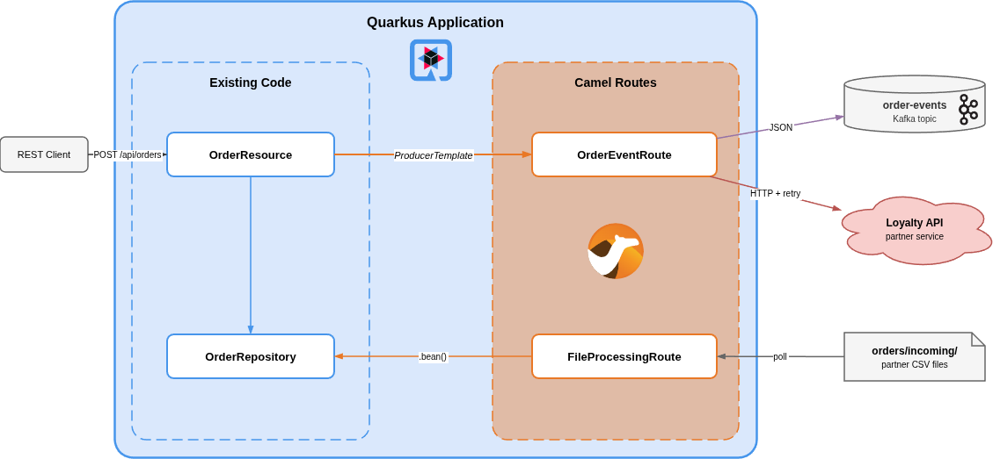
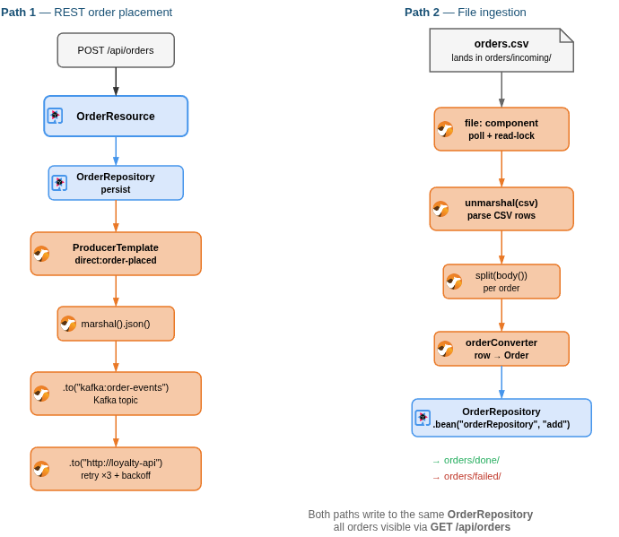

# Extending Your Quarkus Application with Apache Camel

Companion code for the blog post *Extending Your Quarkus Application with Apache Camel*.

Two versions of the same order-management application, showing how to incrementally add Apache Camel routes to an existing Quarkus REST service.

## Structure

```
quarkus-orders/           # Before: plain Quarkus REST app
camel-quarkus-orders/     # After: extended with Camel routes
```

### quarkus-orders (before)

A minimal Quarkus REST application with two endpoints:

- `GET  /api/orders` -- list all orders
- `POST /api/orders` -- create an order

Built with `quarkus-rest-jackson` and an in-memory `OrderRepository`.

### camel-quarkus-orders (after)

The same application extended with seven Camel Quarkus extensions:

| Extension | Purpose |
|---|---|
| `camel-quarkus-direct` | Bridge between JAX-RS and Camel via `ProducerTemplate` |
| `camel-quarkus-kafka` | Publish order events to a Kafka topic |
| `camel-quarkus-jackson` | Marshal orders to JSON |
| `camel-quarkus-http` | Call the Loyalty API |
| `camel-quarkus-file` | Poll CSV files from `orders/incoming/` |
| `camel-quarkus-csv` | Parse CSV file content into rows |
| `camel-quarkus-bean` | Invoke CDI beans from routes |

Two Camel routes are added:

- **OrderEventRoute** -- on every `POST /api/orders`, serializes the order to JSON, publishes to `order-events` Kafka topic, and notifies a Loyalty API (with retry).
- **FileProcessingRoute** -- polls `orders/incoming/` for CSV files, parses rows into `Order` objects, and stores them via `OrderRepository`.





## Running

### quarkus-orders

```bash
cd quarkus-orders
mvn quarkus:dev
```

Swagger UI is available at http://localhost:8080/q/swagger-ui.

### camel-quarkus-orders

```bash
cd camel-quarkus-orders
mvn quarkus:dev
```

Quarkus Dev Services automatically starts a Kafka broker. Swagger UI is available at http://localhost:8080/q/swagger-ui.

#### Try it out

Create an order (triggers the Camel event route):

```bash
curl -X POST http://localhost:8080/api/orders \
  -H 'Content-Type: application/json' \
  -d '{"customer": "Acme Corp", "type": "priority", "amount": 1500.00}'
```

Ingest orders from a CSV file (triggers the file processing route):

```bash
cp sample-data/orders.csv orders/incoming/
```

List all orders (from both REST and file ingestion):

```bash
curl http://localhost:8080/api/orders
```

## Tech stack

- Quarkus 3.38.2
- Apache Camel (managed by `quarkus-camel-bom`)
- Java 21
